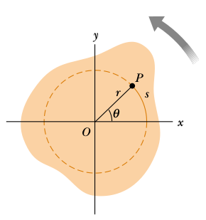
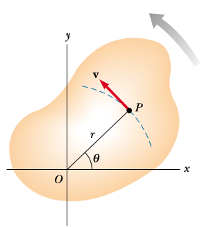
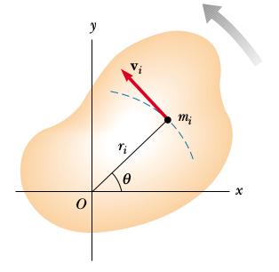

Dönüşler, Dönme Kuvveti (Torque)

Saat yönü tersi yönde bir dönüş düşünelim, $s$ kadar dönüş olduysa, orijine
uzaklık $r$ ise, açısal mesafe [1, sf. 297]

$$
\theta = \frac{s}{r}
$$

ki $\theta$ radyan. Ya da

$$
s = r \theta
$$

Çemberin tamamı $2\pi$ rad (tam bir dönüş), meselâ 60 derece $\pi / 3$
rad. Çemberin çevresinin formülü $2\pi r$, eğer $\theta = \pi / 3$ rad ise,
$s = \pi / 3 \cdot r $.

Açısal hızı bir $P$ noktasının teğetsel hızından yola çıkarak
hesaplayabiliriz, bu noktanın teğetsel hızı sonsuz ufak $s$'nin zamana göre
değişimi olacaktır, yani $v = ds / dt$, 

$$
v = \frac{ds}{dt} = r \frac{d\theta}{dt}
$$

Elde edilen $d\theta / dt$ açısal değişimi gösteriyor, bu işte açısal
hızdır, ona $\omega$ diyelim, o zaman teğetsel hızı açısal hız ile şöyle
gösterebiliriz,

$$
v = r\omega
$$

Formül diyor ki dönen bir katı objenin herhangi bir noktasının teğetsel
hızı, o noktanın dönüş eksenine olan uzaklığı çarpı açısal hızına
eşittir. O zaman, her ne kadar katı objenin her noktası aynı açısal hızla
dönüyor olmasına rağmen her noktanın lineer hızı aynı değildir, çünkü $r$
her nokta için aynı değil. Üstteki formül dönüş merkezinden uzaklaştıkça
hızın artacağını söylüyor. Teğetsel hızı hayal etmek için o noktada ayakta
durabiliyor olsak yüzümüze çarpacak rüzgar hızını hayal edebiliriz. 

İvmeyi de dahil edelim, açısal ivme ile teğetsel ivmenin bağlantısına
bakalım, $v$'nin zamana göre türevini alırsak,

$$
a_t = \frac{dv}{dt} = r \frac{d\omega}{dt}
$$

$$
a_t = r \alpha
$$

Dönüşsel Kinetik Enerji

Dönmekte olan katı bir objenin kinetik enerjisini nasıl hesaplarız? 

Objenin en ufak parçalarından başlayarak bunu yapmaya uğraşalım. Obje
$z$ ekseni etrafında dönüyor olsun, ve açısal hızı $\omega$
diyelim. Obje içindeki her parçacık $i$'nin kütlesi $m_i$ diyelim,
kinetik enerji bu parçacığın lineer hızına bağlıdır (objenin her
parçacığı aynı açısal hızda döner ama farklı noktalarda lineer hız
$v_i$ farklı olabilir, $v_i = r_i \omega$ üzerinden), o zaman her
parçacık için kinetik enerji [1, sf. 299]

$$
K_i = \frac{1}{2} m_i v_i^2
$$

ile gosterilebilir. Tum obje icin, 

$$
K_R = \sum_i K_i =
\sum_i \frac{1}{2} m_i v_i^2 =
\frac{1}{2} \sum_i m_i r_i^2 \omega^2
$$

Bu ifadede $\omega^2$'yi dışarı çekebiliriz, çünkü her parçacık için aynı,

$$
K_R = \frac{1}{2} \left( \sum_i m_i r_i^2 \right) \omega^2
$$

Parantez içindeki ifadeye bir isim verip değişken atayarak daha da işi
basitleştirebiliriz, bu ifadeye dönme direnci (moment of inertia) ismi
verilir,

$$
I \equiv  \sum_i m_i r_i^2
$$

$I$'nin birimi $kg \cdot m^2$'dir, bu notasyonla nihai denklem

$$
K_R = \frac{1}{2} I \omega^2
$$

haline gelir. 

Kaynaklar

[1] Resnick, {\em Fundamentals of Physics, 8th Ed}
